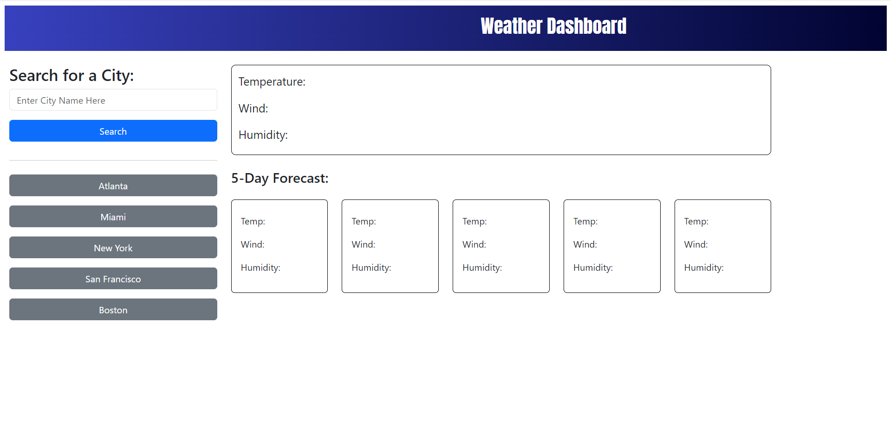

# My Weather Dashboard

## Description

I am tasked with creating a website that displays the weather of a city that the user searches for. I was able to use the open weather API and apply it to functions in order to receive the latest weather status as well as the 5 day future forecast. With this project I developed a better understanding on how to utilize APIs in my code, how to save and retrieve data stored in local storage, and how to use Bootstrap. 

## Table of Contents

- [Usage](#usage)
- [Credits](#credits)
- [License](#license)

## Usage

<a href="https://github.com/Kadeemking/Module-6-Challenge">Github Repo</a>

<a href="https://kadeemking.github.io/Module-6-Challenge/">Live Page</a>

## Credits

<a href="https://gist.github.com/lukas-h/2a5d00690736b4c3a7ba">License for README</a>

<a href="https://openweathermap.org/api">Open Weather API</a>

<a href="https://getbootstrap.com/">Bootstrap Library</a>

## License

